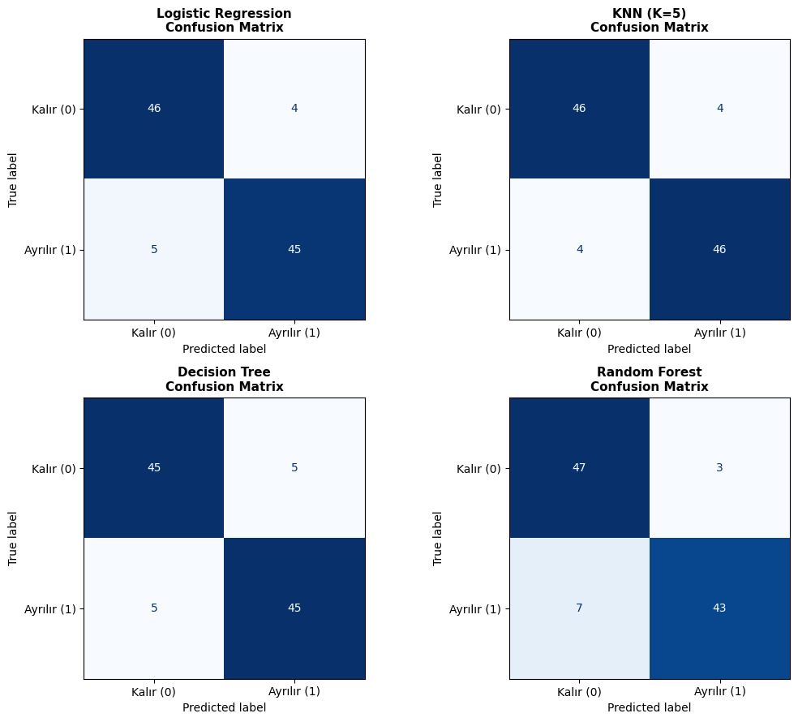

# 🚀 Müşteri Churn (Ayrılma) Tahmini Makine Öğrenmesi Projesi

Bu proje, bir şirketin müşteri kayıp (churn) riskini önceden tahmin etmek ve müşteri elde tutma stratejileri geliştirmek amacıyla uçtan uca oluşturulmuş bir **Machine Learning Pipeline** uygulamasıdır.

Proje kapsamında sentetik veriler üretilmiş, eksik değer doldurma, öznitelik mühendisliği (feature engineering), veri dönüştürme (encoding) ve standartlaştırma (scaling) adımları uygulanmış; ardından 4 farklı sınıflandırma modeli eğitilerek karşılaştırılmıştır.


## 📌 Proje Mimarısı ve Adımları

1. **Veri Üretimi ve Dengeleme:**
   - 500 örnekli sentetik müşteri veri seti oluşturulmuştur.
   - Sınıf dengesizliğini (class imbalance) önlemek amacıyla hedef değişken (`churn`), olasılıkların medyan değeri baz alınarak tam **%50 Kalır (0)** ve **%50 Ayrılır (1)** şeklinde dengelenmiştir.

2. **Veri Ön İşleme (Preprocessing):**
   - **Eksik Değer Yönetimi:** `gelir` sütunundaki rastgele %10 eksik değer medyan ile doldurulmuştur (`Imputation`).
   - **Öznitelik Mühendisliği:** `yas` değişkeninden `yas_grubu` (Genç, Orta Yaş, Kıdemli) türetilmiştir.
   - **Encoding:** `uyelik_tipi` ve `yas_grubu` için Ordinal Encoding; `sehir` değişkeni için One-Hot Encoding uygulanmıştır.
   - **Veri Bölme:** Veri seti Train (%60), Validation (%20) ve Test (%20) olmak üzere 3 katmana ayrılmıştır (`stratify=y`).
   - **Standartlaştırma:** Sayısal öznitelikler `StandardScaler` kullanılarak ölçeklenmiş, Veri Sızıntısı (Data Leakage) önlenmiştir.

3. **Eğitilen Modeller:**
   - **Logistic Regression**
   - **K-Nearest Neighbors (KNN, K=5)**
   - **Decision Tree (Max Depth=5)**
   - **Random Forest (N-Estimators=100)**

---

## 📊 Model Performans Sonuçları

Test verisi (100 örnek) üzerinde elde edilen nihai performans karşılaştırma tablosu aşağıdadır:

| Model | Val Accuracy | Test Accuracy | Test Precision | Test Recall | Test F1-Score | Test ROC-AUC | TN (Doğru Kalır) | FP (Yanlış Churn) | FN (Kaçırılan Churn) | TP (Yakalanan Churn) |
| :--- | :---: | :---: | :---: | :---: | :---: | :---: | :---: | :---: | :---: | :---: |
| **Logistic Regression** | 0.94 | 0.91 | 0.9184 | 0.9000 | 0.9091 | 0.9728 | 46 | 4 | 5 | 45 |
| **KNN (K=5)** | 0.90 | **0.92** | 0.9200 | **0.9200** | **0.9200** | 0.9688 | 46 | 4 | 4 | **46** |
| **Decision Tree** | 0.87 | 0.90 | 0.9000 | 0.9000 | 0.9000 | 0.9266 | 45 | 5 | 5 | 45 |
| **Random Forest** | 0.91 | 0.90 | **0.9348** | 0.8600 | 0.8958 | **0.9766** | **47** | **3** | 7 | 43 |

---

## 📈 Confusion Matrix (Karmaşıklık Matrisi) Görselleştirmesi

Modellerin Test kümesi üzerindeki tahmin dağılımlarını gösteren matris grafiği:



---

## ⚙️ Kurulum ve Çalıştırma

1. Gerekli kütüphaneleri yükleyin:
   ```bash
   pip install pandas numpy scikit-learn matplotlib seaborn

2. Projeyi çalıştırın:
   ```bash
   python main.py
